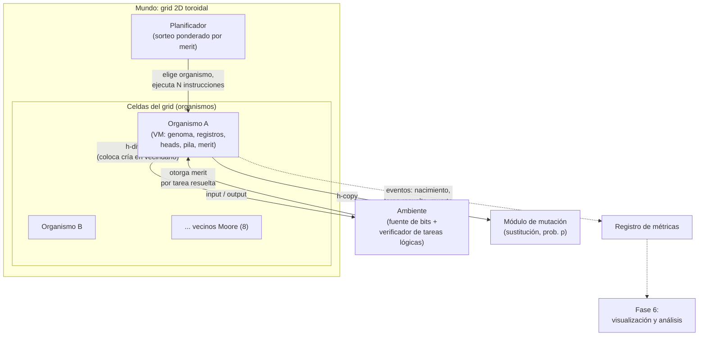

# Arquitectura — proVida

Stack: **Python 3**. Decisiones de diseño tomadas en Fase 2, con su justificación.

## Decisiones de diseño confirmadas

| Decisión | Elegido | Por qué |
|---|---|---|
| Stack tecnológico | Python | Legibilidad pedagógica máxima + mejor ecosistema para Fase 6 (matplotlib, pandas, networkx). Riesgo de rendimiento aceptado para el tamaño de población del MVP. |
| Direccionamiento de saltos | Indexado simple (offsets relativos) | El MVP solo tiene mutación por sustitución (no inserción/deleción), así que el genoma nunca cambia de tamaño — el problema que resuelven los nop-labels de Avida real casi no aplica todavía. Prioriza velocidad de aprendizaje sobre fidelidad total. |
| Topología del mundo | Grid espacial 2D toroidal, vecindario de Moore (8 vecinos) | Fiel al Avida real; permite observar fenómenos espaciales (un genotipo "invadiendo" territorio) que serán muy visibles en la Fase 6. |

## 1. Lenguaje de instrucciones

Set reducido de 15 instrucciones. Nota importante: la **única instrucción lógica es `nand`** — deliberadamente no existen instrucciones `and`, `or`, `not` directas. NAND es funcionalmente completa (cualquier función booleana se puede construir combinando NAND), así que darle solo esa pieza al organismo es lo que obliga a que resolver NOT o AND sea algo que la **evolución tiene que descubrir** combinando instrucciones — si le diéramos AND directo, la tarea "AND" dejaría de ser un logro evolutivo y pasaría a ser trivial. Esto replica fielmente el diseño real de Avida y es el corazón de por qué el sistema produce complejidad interesante.

| Instrucción | Efecto |
|---|---|
| `nop` | No hace nada (relleno) |
| `mov Rd, Rs` | `Rd ← Rs` |
| `inc R` | `R ← R + 1` |
| `dec R` | `R ← R - 1` |
| `add Rd, Rs` | `Rd ← Rd + Rs` |
| `nand Rd, Rs` | `Rd ← NAND(Rd, Rs)` bit a bit — única instrucción lógica |
| `push R` | Apila el valor de `R` |
| `pop R` | Desapila hacia `R` |
| `jmp offset` | Salto relativo incondicional |
| `jmp-if-zero R, offset` | Salto relativo si `R == 0` |
| `input R` | Lee un bit aleatorio del ambiente hacia `R` |
| `output R` | Entrega `R` como salida; el ambiente revisa si resuelve alguna tarea lógica pendiente |
| `h-alloc` | Reserva memoria para el genoma de la cría |
| `h-copy` | Copia la instrucción en `read-head` hacia `write-head` (con probabilidad `p` de mutación), avanza ambos heads |
| `h-divide` | Finaliza la replicación: separa la cría como nuevo organismo y lo coloca en el vecindario del grid |

## 2. Máquina virtual (VM)

Cada organismo tiene su propio estado de VM:

- **Registros:** `AX`, `BX`, `CX` (enteros).
- **Pila:** compartida entre registros, LIFO.
- **Puntero de instrucción (IP):** posición actual de ejecución normal.
- **Read-head / Write-head:** posiciones usadas exclusivamente por `h-copy` durante la auto-replicación — independientes del IP, para que "ejecutarse" y "copiarse" sean procesos conceptualmente paralelos.
- **Merit:** valor numérico que determina la probabilidad de ser elegido por el planificador (ver sección 3).
- **Tareas ya resueltas:** registro de qué tareas lógicas ya premiaron a este organismo (cada tarea se recompensa **una sola vez por organismo**, para que no pueda explotar la recompensa repitiendo el mismo output infinitas veces).
- **Últimos inputs recibidos:** necesarios para que `output` pueda verificarse contra las tareas lógicas (NOT necesita el último input; AND/NAND necesitan los dos últimos).

## 3. Motor de mundo / población

- **Grid 2D toroidal** de tamaño configurable (ej. 20×20 = 400 celdas máximo). Toroidal = los bordes se conectan (como un mapa que da la vuelta), para que no haya organismos "en el borde" con menos vecinos — evita un sesgo artificial de selección solo por posición geométrica.
- **Planificador ponderado por merit:** en cada "time slice" global, se sortea qué organismo ejecuta su siguiente bloque de instrucciones, con probabilidad proporcional a su merit relativo dentro de la población completa. No hay tiempo real ni concurrencia — es un bucle síncrono con sorteo ponderado.
- **Reemplazo por vecindario (Moore, 8 vecinos):** cuando un organismo ejecuta `h-divide`, la cría se coloca en una celda del vecindario de 8 posiciones alrededor del padre. Si esa celda está ocupada, el organismo que estaba ahí es reemplazado (muere). Esto es lo que produce competencia espacial local: los genotipos exitosos forman "manchas" que se expanden gradualmente, en vez de invadir instantáneamente todo el grid.

## 4. Sistema de mutación

- **Tipo:** solo sustitución en el MVP (una instrucción copiada se reemplaza por una instrucción aleatoria del set completo).
- **Momento:** ocurre exclusivamente durante `h-copy`, instrucción por instrucción.
- **Tasa por defecto:** 0.75% por instrucción copiada (valor clásico de Avida), expuesta como parámetro configurable del motor — no hardcodeada — para poder experimentar con presión mutacional más adelante (Fase 7).

## 5. Sistema de recompensa por tareas lógicas

Tareas del MVP (subconjunto pequeño, en orden de dificultad creciente):

1. **NOT** — `output == NOT(último input)`
2. **AND** — `output == AND(input[-2], input[-1])`
3. **NAND** — `output == NAND(input[-2], input[-1])` (nota: esta es "gratis" en cierto sentido porque coincide con la instrucción primitiva, pero el organismo igual tiene que orquestar `input`/`output` correctamente para reclamarla)

Cuando el ambiente detecta que un `output` resuelve una tarea no reclamada antes por ese organismo, **multiplica** su merit (no lo suma) por un bono creciente con la dificultad: NOT ×2, AND ×4, NAND ×8. Multiplicativo y no aditivo porque en Avida real resolver varias tareas compone la ventaja reproductiva en vez de sumarla — un organismo que resuelve dos tareas no es "un poco mejor", es dramáticamente mejor. Un merit más alto no ejecuta "más rápido" de forma determinista — aumenta la *probabilidad* de ser elegido por el planificador ponderado (sección 3), lo cual en promedio, sobre muchas rondas, se traduce en más réplicas. Esto es exactamente el mecanismo por el cual "resolver una tarea" se convierte en "dejar más descendencia" sin que el código declare un fitness explícito en ningún lado — el fitness es una consecuencia observada, no una variable que el sistema asigna directamente.

Al nacer, una cría hereda tanto el merit acumulado de su padre como el conjunto de tareas ya acreditadas por su linaje — así, un descendiente con el mismo comportamiento no vuelve a cobrar el mismo bono (lo que inflaría el merit sin límite generación tras generación), pero si una mutación le permite resolver una tarea nueva que su linaje nunca había logrado, sí cobra ese bono adicional. Limitación aceptada conscientemente: si una mutación *rompe* la capacidad de resolver una tarea ya acreditada, la cría conserva igual el merit heredado por esa tarea — el merit refleja el historial del linaje, no la capacidad actual verificada en cada generación.

## 6. Diagrama de arquitectura



## 7. Estructura de módulos prevista (referencia para Fase 3)

```
provida/
  vm/            # instrucciones, VM individual, ejecución de un organismo
  world/         # grid, planificador, colocación/reemplazo de organismos
  mutation/      # lógica de sustitución durante h-copy
  tasks/         # definición y verificación de tareas lógicas
  metrics/       # registro de eventos para la Fase 6
  cli.py         # punto de entrada para correr simulaciones desde terminal
tests/
docs/
```

Esta estructura es orientativa — se ajustará en la Fase 3 cuando se inicialice el repo real.

## 8. Extensión (Fase 7): direccionamiento por contenido e indels

La Fase 2 eligió direccionamiento indexado simple, aceptando conscientemente una limitación: el genoma no podía cambiar de tamaño. Esta extensión la resuelve, **añadiendo** instrucciones nuevas sin tocar ni romper nada de las Fases 1-6 (`jmp`/`jmp-if-zero` con offsets numéricos siguen existiendo tal cual; los genomas y pruebas de las fases anteriores no se modificaron, salvo dos ajustes de semántica documentados abajo).

**Instrucciones nuevas:** `nop-a`/`nop-b`/`nop-c` (marcadores de etiqueta, sin efecto propio al ejecutarse) y tres saltos por etiqueta: `jmp-etiqueta` (incondicional), `jmp-cero-etiqueta` (condicional a un registro) y `jmp-vuelta-etiqueta` (condicional a que el `read_head` haya dado una vuelta completa al genoma circular — la nueva condición de "terminé de copiarme", sin contar instrucciones).

**Mecanismo:** un salto por etiqueta lee los nops que lo siguen inmediatamente ("mi etiqueta"), calcula su complemento cíclico (`nop-a↔nop-b↔nop-c↔nop-a`) y busca esa secuencia complementaria más adelante en el genoma circular; el destino es la posición justo después de encontrarla. Si no encuentra nada (etiqueta rota por mutación, por ejemplo), el salto simplemente no ocurre — consistente con la filosofía ya establecida de que un genoma mal formado falla en silencio, no crashea la simulación.

**Mutación por inserción/deleción:** `provida/mutation/sustitucion.py` gana `procesar_copia()`, que además de sustituir puede insertar una instrucción extra o eliminar la que se estaba copiando. Con `tasa_insercion=tasa_delecion=0.0` (el valor por defecto), consume el generador aleatorio exactamente igual que la función anterior — deliberado, para no invalidar las pruebas de regresión de la Fase 5.

**Cambio de semántica en `h-alloc`/`h-copy`/`h-divide`:** antes, la cría era un arreglo de tamaño fijo (`len(genoma_hijo) == len(genoma_padre)`) y "completa" significaba "sin huecos". Eso es incompatible con una cría que puede crecer o encoger. Ahora `genoma_hijo` es una lista que crece con cada `h-copy`, y `h-divide` completa la replicación con cualquier cría no vacía — el organismo decide cuándo ha copiado lo suficiente (típicamente con `jmp-vuelta-etiqueta`), y `h-divide` confía en esa decisión, igual que Avida real. Un `h-divide` prematuro ya no "falla" — completa con una cría truncada y defectuosa, que es la selección natural quien debe penalizar, no el mecanismo de copia. Se añadió un tope de seguridad (`LONGITUD_MAXIMA_HIJO_RELATIVA = 4`, es decir, 4x el tamaño del padre) para que un genoma sin condición de salida no crezca sin límite.

**Hallazgo real al construir el demo de esta extensión** (`examples/demo_evolucion_tamano.py`): tras 100 000 turnos con inserción/deleción activas (1% cada una) sobre el genoma ancestral por etiquetas (10 instrucciones), la población de 144 organismos terminó con genomas de entre 1 y 15 instrucciones. Sorprendentemente, **46 de 144 organismos (32%) tenían genomas de una sola instrucción** — replicadores degenerados que, de alguna manera, logran completar `h-divide` con una cría mínima y perpetuarse. El genotipo original (10 instrucciones) seguía siendo el más común individualmente (69/144, 48%), pero el promedio de la población quedó por debajo del original (~6-8 instrucciones), arrastrado por estos "tramposos" de una instrucción. No investigamos a fondo el mecanismo exacto de estos replicadores mínimos -- queda como pregunta abierta para explorar más, y es honestamente el tipo de fenómeno emergente inesperado (organismos "parásitos" o degenerados que se propagan sin hacer nada útil) que también se ha observado en Avida real.

## 9. Extensión: presión de selección por temperatura

Simula selección por un **óptimo ambiental que se mueve con el tiempo** — el mismo fenómeno que se estudia en biología del cambio climático: ¿la evolución logra "perseguir" un óptimo que cambia (*evolutionary rescue*), o el cambio es tan rápido que la población no lo alcanza?

**Decisión de diseño central:** la temperatura óptima de un organismo **no es un campo oculto** — es el resultado de ejecutar una instrucción nueva, `set-temperatura R` (`provida/vm/cpu.py`), que toma el valor que el organismo ya construyó en un registro (con `inc`/`add`, como cualquier otro cálculo) y lo mapea a un rango acotado (`provida.tasks.temperatura.valor_a_temperatura`, vía módulo — así ningún organismo necesita evitar el desbordamiento a propósito). Es exactamente la misma filosofía que ya rige `output`/las tareas lógicas: un rasgo es comportamiento ejecutado, no una propiedad asignada por fuera. Ventaja práctica notable: la **herencia sale gratis** — un hijo hereda el genoma (con sus mutaciones) y, al ejecutar su propia copia de `set-temperatura`, recalcula su propia temperatura óptima solo; no hizo falta ninguna plomería especial de herencia (a diferencia de `tareas_resueltas` en la Fase 6, que sí la necesitó).

**Ambiente:** `provida.tasks.Ambiente` gana un calendario de temperatura por rampa lineal (`temperatura_en(turno) = temperatura_inicial + tasa_cambio_temperatura * turno`). Con `tasa_cambio_temperatura=0.0` (por defecto) la temperatura es constante.

**Efecto sobre el fitness:** `provida.tasks.temperatura.factor_temperatura` es una campana de Gauss centrada en la temperatura óptima del organismo — 1.0 si coincide exactamente con la temperatura actual, decae suavemente (nunca llega a 0 en seco) mientras más se alejan. A propósito es un **multiplicador dinámico recalculado en cada turno del planificador** (`Mundo._peso_efectivo`), no un bono fijo al nacer como las tareas: un organismo bien adaptado hoy puede perder ventaja mañana si el ambiente sigue cambiando y su linaje no lo alcanza a seguir.

**Compatibilidad total hacia atrás:** un organismo que nunca ejecuta `set-temperatura` tiene `temperatura_optima=None`, tratado como neutral (factor 1.0) — así ningún genoma de las Fases 1-8 se ve afectado. `Mundo._peso_efectivo` devuelve exactamente `cpu.merit` sin ambiente o sin temperatura declarada.

**Hallazgo real al calibrar el experimento** (`examples/demo_temperatura.py`): el primer diseño (4 genotipos con temperaturas óptimas muy separadas -30/-10/10/30°C, compitiendo desde el inicio) fracasó — con un ancho de tolerancia de 15°C, los fundadores más alejados de la temperatura inicial partían con una desventaja tan aplastante (factor ≈10⁻⁷) que se extinguían casi de inmediato, mucho antes de que el ambiente llegara a favorecerlos. El diseño que sí funcionó con claridad: **solo dos genotipos** con temperaturas óptimas más cercanas entre sí (-15°C y +15°C), ambos con una oportunidad real desde el principio. Con el ambiente calentándose de -15°C a ~+33°C en 160 000 turnos, la dominancia se invierte limpiamente: el genotipo frío domina mientras el ambiente sigue frío, y para el turno 160 000 el cálido ya representa 209/225 (~93%) de la población. Un control sin calentamiento confirma que la inversión es real (el frío se queda con 223/225 si la temperatura no cambia). La lección honesta: la "persecución" de un óptimo que se mueve funciona mucho mejor a partir de **variación genética preexistente** (varios genotipos ya compitiendo) que de mutación nueva emergiendo sobre la marcha en un solo linaje — con mutación sola, en pruebas con un único fundador, el promedio de la población apenas se movió unos pocos grados en cientos de miles de turnos. Es una distinción real en biología evolutiva (adaptación desde *standing variation* vs. desde mutación de novo), no una limitación oculta del simulador.
